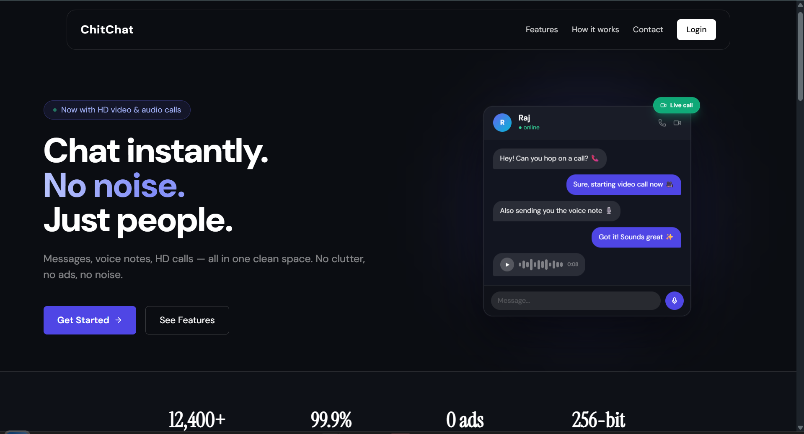
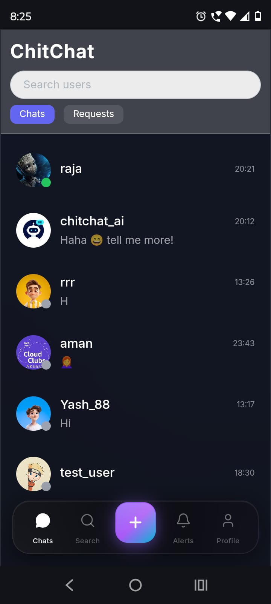
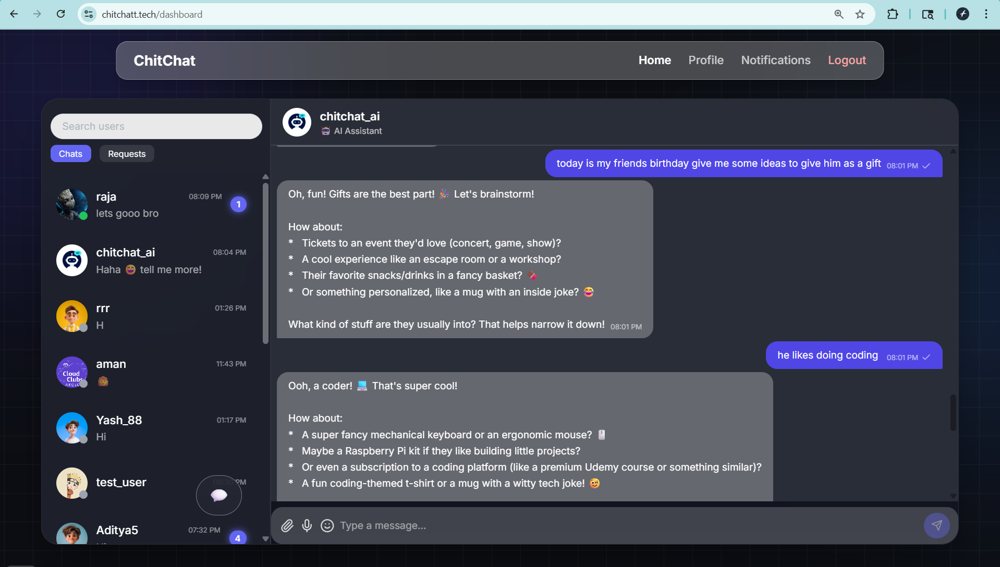
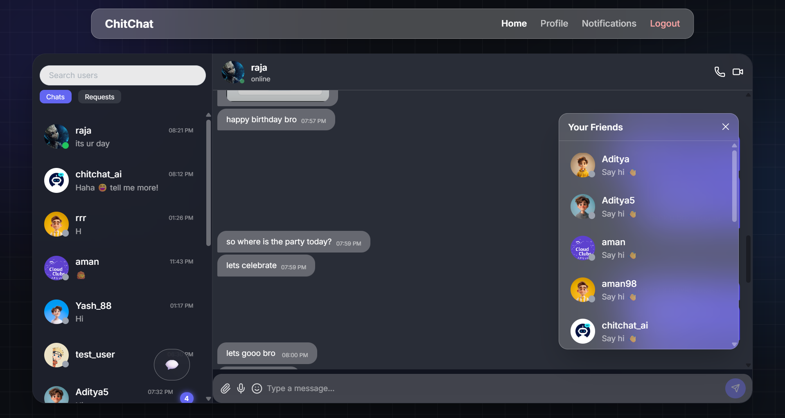

# ChitChat 💬

ChitChat is a real-time communication platform built with a modern full-stack architecture,
focused on performance, scalability, and clean separation of concerns.

It goes beyond basic messaging by integrating **real-time chat, media sharing, and peer-to-peer audio/video calling**,
simulating a production-grade communication system.

---

## ✨ Why ChitChat?

Most chat applications hide complexity behind simple UI.
ChitChat is built to **embrace that complexity**—handling real-time messaging,
state synchronization, pagination, socket-driven updates, and peer-to-peer communication
in a clean and maintainable way.

This project prioritizes:

* Real-world architecture
* Clean code separation
* Scalable real-time communication
* Industry-aligned development practices

---

## 🎬 App Demo

<div align="center" style="margin-bottom: 30px;">
  
  
</div>

<div align="center" style="margin-bottom: 30px;">
  
  
</div>


---
## 🚀 Core Capabilities

* Secure user authentication (JWT-based)
* One-to-one real-time messaging
* Socket-based instant message delivery
* Optimistic UI updates for seamless UX
* Message pagination & scroll preservation
* Reply-to message support
* Delivery & read receipts
* Media sharing (files, attachments, audio)
* 🎙️ Voice messaging support
* 📹 Real-time audio & video calling (WebRTC)
* Modular frontend and backend separation
* Extensible architecture for future AI integration

---

## 🏗️ Architecture Overview

ChitChat follows a client-server architecture with a dedicated real-time and peer communication layer:

* **Frontend**: Manages UI, state, socket listeners, and WebRTC connections
* **Backend**: Handles authentication, APIs, message persistence, and socket signaling
* **Realtime Layer**: Socket.io enables instant bi-directional communication
* **Peer Layer (WebRTC)**: Handles audio/video streaming between users
* **Database**: MongoDB stores users, chats, and messages

---

## 📁 Project Structure

```txt
chitchat/
├── .github/              # GitHub workflows
├── frontend/             # Client-side application (React + Vite)
├── backend/              # Server-side APIs & socket server
├── docker-compose.yml    # Docker configuration for local development
└── README.md             # Project overview
```

---

## 🛠️ Technology Stack

### Frontend

* React (Vite)
* Context API
* Custom Hooks
* Socket.io Client
* WebRTC APIs

### Backend

* Node.js
* Express
* MongoDB
* JWT Authentication
* Socket.io

---

## ⚙️ Getting Started

```bash
# Clone the repository
git clone https://github.com/raj-krr/chitchat.git

# Start backend
cd backend
npm install
npm run dev

# Start frontend
cd frontend
npm install
npm run dev
```

---

## 🔒 Authentication Flow (High Level)

1. User registers or logs in
2. Backend issues a JWT
3. Token is stored on the client
4. Authenticated API requests and socket connections use the token

---

## 🌐 Realtime Messaging Flow

1. User sends a message
2. Frontend updates the UI optimistically
3. Message is emitted through a socket event
4. Backend validates and persists the message
5. Receiver is notified instantly via socket

---

## 📞 Audio & Video Calling Flow

1. User initiates a call
2. Socket event is sent to the receiver (call-user)
3. WebRTC peer connection is created
4. Offer/Answer exchange happens via socket signaling
5. ICE candidates are shared
6. Direct peer-to-peer media stream is established

> ⚡ Socket.io is used for signaling, while WebRTC handles real-time media streaming

---

## 🧠 Key Engineering Highlights

* WebRTC-based peer-to-peer communication
* Socket-driven signaling architecture
* Optimistic UI with rollback handling
* Efficient state management using Context API
* Scalable backend structure with modular services

---

## 🧪 Project Status

* ✅ Authentication system implemented
* ✅ Core real-time messaging
* ✅ Message pagination & UI optimization
* ✅ Delivery & read receipts
* ✅ Media handling (files, audio messages)
* ✅ Real-time audio & video calling (WebRTC)
* ✅ AI-assisted features

---

## 🌐 Live Demo


🚀 Try it here: https://chitchatt.tech

- 🔐 Create an account or log in
- 💬 Start real-time chatting instantly
- 📞 Try audio/video calling in action

---

## 🤝 Contributing

Contributions are welcome.
Please follow the existing project structure and coding conventions.
Refer to the frontend and backend READMEs for implementation details.

---

## 📄 License

This project is intended for learning, portfolio, and development use.
