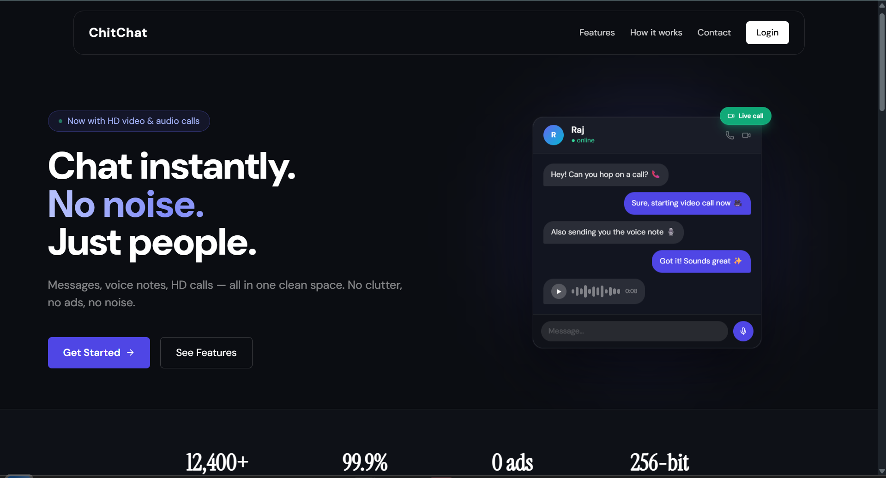
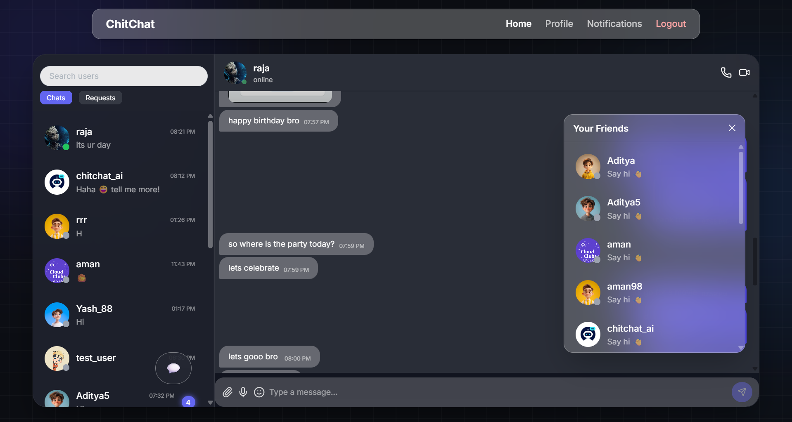
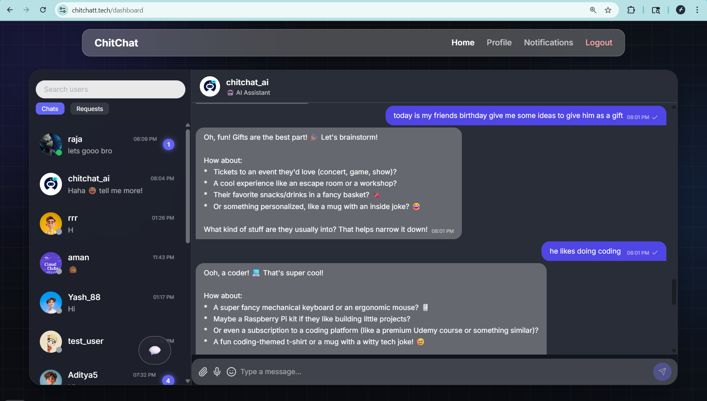

# ChitChat - Real-Time Communication Platform

[](https://nodejs.org/)
[](https://www.typescriptlang.org/)
[](https://expressjs.com/)
[](https://react.dev/)
[](https://vitejs.dev/)
[](https://socket.io/)
[](https://mongoosejs.com/)
[](https://groq.com/)
[](https://cloudinary.com/)
[](https://opensource.org/licenses/ISC)

**ChitChat** is a high-performance, real-time communication platform engineered to power 1-on-1 direct messaging, multi-participant group chats, WebRTC peer-to-peer audio/video calling, Groq AI smart reply generation, and Cloudinary media processing. Built with Node.js, Express 5, React 19, Vite 7, TypeScript 5.9, Socket.io 4.8, and MongoDB, ChitChat delivers a modern, production-grade communication environment.

> 🔗 **Repositories Ecosystem & Links**:
> - 🌐 **Live Platform**: [https://chitchatt.tech](https://chitchatt.tech)
> - ⚙️ **Backend Module**: [https://github.com/raj-krr/chitchat/tree/main/backend](https://github.com/raj-krr/chitchat/tree/main/backend)
> - 🎨 **Frontend Module**: [https://github.com/raj-krr/chitchat/tree/main/frontend](https://github.com/raj-krr/chitchat/tree/main/frontend)

---

## 🎬 App Screenshots & UI Experience

<div align="center" style="margin-bottom: 30px;">
  
  <br /><br />
  
  
</div>

---

## 🎯 Full-Stack Context & Problem ChitChat Solves

Building a production-grade real-time application introduces technical complexities that standard CRUD backends and simple frontend setups cannot handle:

1. **High-Frequency Messaging & Anti-Spam Safeguards**: Processing incoming socket events across active connections without triggering server freezes. ChitChat resolves this via an in-memory **Sliding-Window Anti-Spam Engine** (800ms cooldown, 25 msgs/10s flood cap with 60s temporary mute).
2. **WebRTC P2P Video/Audio Huddle Signaling**: Managing peer-to-peer audio and video calls directly between clients using Socket.io to exchange SDP offers/answers and ICE candidate payloads with Web Audio API ringtone fallback.
3. **Groq AI Smart Assistance Integration**: Integrating Groq's `llama-3.3-70b-versatile` model to provide context-aware response suggestions and dedicated AI chatbot interactions.
4. **Optimistic UI Updates with State Rollback**: Delivering zero-latency messaging by immediately reflecting send actions on the UI (`sending` ⏳ ➔ `sent` ✓ ➔ `delivered` ✓✓ ➔ `read` 🔵), with error handling on network failure.
5. **Multi-Tenant Security & Dual JWT Token Authentication**: Protecting access with dual JWT access & refresh tokens stored in HttpOnly cookies, Nodemailer OTP verification for signups and password resets, and Zod input validation schemas.

---

## 🚀 Key Platform Capabilities

### 1. 💬 Real-Time Messaging & Group Chats
- **Socket.io Real-Time Engine**: Authenticated socket handshakes supporting private 1-on-1 messaging and workspace group rooms (`group:${groupId}`).
- **Rich Media Sharing**: Voice message recording, image previews, video attachments, and document uploads via Cloudinary.
- **Message Controls**: Reply quotes, emoji reactions, message deletion (delete for me / delete for everyone), and typing indicators.

### 2. 📹 WebRTC Audio & Video Calling Subsystem
- **P2P Audio & Video Calls**: Peer-to-peer media stream connection configured with STUN/TURN ICE servers (`CallContext.tsx`).
- **Call Management**: Incoming call ringtone notifications, busy signal handling, missed call logs, audio mute, video toggle, and camera flip.
- **Web Audio API Synthesizer**: Pure JavaScript audio synthesizer rendering custom ringtones without external network file dependencies.

### 3. 🤖 Groq AI Assistant & Smart Reply Chips
- **AI Chatbot**: Dedicated system AI user (`isBot: true`) maintaining a rolling 6-message context window powered by Groq Llama 3.3.
- **Smart Reply Chips**: Automatically generates 3 context-aware response chips above the chat composer for instant messaging.

### 4. 🎨 Dynamic Multi-Theme Engine & Responsive Design
- **4 Built-In Themes**: Seamlessly switches between `light`, `dark`, `cyberpunk`, and `system` themes across Tailwind CSS, Mantine UI, and DaisyUI.
- **Responsive Glassmorphism UI**: Polished UI with glassmorphic top navigation bar, floating action tooltips, and responsive layout for mobile and desktop screens.

---

## 🏗️ Full-Stack Architecture Topology

```
┌────────────────────────────────────────────────────────────────────────────────────────┐
│                             ChitChat Frontend (React 19 + Vite)                        │
│ ┌──────────────────────┐  ┌──────────────────────┐  ┌────────────────────────────────┐ │
│ │   Chat Canvas & UI   │  │    Context Layer     │  │      WebRTC Call Overlay       │ │
│ │(Optimistic Updates)  │  │(Auth, Call, Presence)│  │    (P2P Audio/Video Media)     │ │
│ └──────────┬───────────┘  └──────────┬───────────┘  └───────────────┬────────────────┘ │
└────────────┼─────────────────────────┼──────────────────────────────┼──────────────────┘
             │                         │                              │
             │ REST API (Axios)        │ Socket.io & WebRTC           │ Media & AI
             ▼                         ▼                              ▼
┌────────────────────────────────────────────────────────────────────────────────────────┐
│                        ChitChat Backend (Express 5 + Socket.io 4)                      │
│ ┌──────────────────────┐  ┌──────────────────────┐  ┌────────────────────────────────┐ │
│ │   REST Controllers   │  │ Socket.io Handlers   │  │      WebRTC Signaling Engine   │ │
│ │(Auth, User, Message) │  │ (Presence, Anti-Spam)│  │     (ICE Candidate Relay)      │ │
│ └──────────┬───────────┘  └──────────┬───────────┘  └───────────────┬────────────────┘ │
└────────────┼─────────────────────────┼──────────────────────────────┼──────────────────┘
             │                         │                              │
             ▼                         ▼                              ▼
 ┌───────────────────────┐   ┌───────────────────────┐   ┌───────────────────────────┐
 │ MongoDB Atlas Database│   │ Cloudinary Media CDN  │   │   Groq Llama 3.3 AI Engine│
 └───────────────────────┘   └───────────────────────┘   └───────────────────────────┘
```

---

## 📊 Database Models (Mongoose Schemas)

| Model | File Location | Description |
| :--- | :--- | :--- |
| **User** | `backend/src/models/user.model.ts` | Stores credentials, hashed passwords, email verification OTP code, avatars, and status states. |
| **Message** | `backend/src/models/message.model.ts` | Persistent text & media logs, delivery receipts (`sent`/`delivered`/`read`), reactions, and `deletedFor` list. Compound index on `{ senderId, receiverId, createdAt }`. |
| **Group** | `backend/src/models/group.model.ts` | Multi-user group metadata, admin user reference, member arrays, and unique invite codes. |
| **FriendRequest** | `backend/src/models/friendRequest.model.ts` | Manages friend request relationships (`pending`, `accepted`, `rejected`). |
| **Notification** | `backend/src/models/notification.model.ts` | Real-time user notification logs for call alerts, friend requests, and updates. |

---

## 🔌 API & Socket Event Matrix

### REST API Summary
- **`POST /api/auth/register`**: Register new user account & dispatch verification email.
- **`POST /api/auth/verifyEmail`**: Verify email address using 6-digit OTP.
- **`POST /api/auth/login`**: Authenticate user & issue JWT cookies.
- **`GET /api/me/getuser`**: Fetch active authenticated user profile.
- **`GET /api/message/chats`**: Retrieve user chat thread list with unread message counts.
- **`GET /api/message/chat/:id`**: Fetch message history between two users.
- **`POST /api/message/send/:id`**: Transmit text message or file attachment.
- **`POST /api/ai/smart-replies`**: Fetch 3 Groq AI-generated smart reply chips.
- **`GET /api/health`**: Return server health status, uptime, memory, and database connection state.

### Socket.io Events Matrix
- **`send_message` / `receive_message`**: Transmits instant message payloads across recipient sockets.
- **`typing` / `stop-typing`**: Broadcasts typing indicators to active chat windows.
- **`call-user` / `incoming-call`**: Relays WebRTC SDP call offer to recipient client.
- **`answer-call`**: Relays WebRTC SDP call answer back to initiator.
- **`ice-candidate`**: Exchanges ICE candidates for WebRTC peer connection setup.
- **`reject-call` / `end-call`**: Relays call rejection or termination signals.

---

## 📁 Source Code Directory Layout

```
chitchat/
├── backend/                   # Express 5 + Socket.io 4 Server Platform
│   ├── dist/                  # Compiled JavaScript build files
│   ├── src/
│   │   ├── __tests__/         # Automated Jest API test suites
│   │   ├── controllers/       # REST API request controllers
│   │   ├── libs/              # DB, Groq AI, and Cloudinary SDK setups
│   │   ├── middlewares/       # Auth, Validation, Permission & Error handling
│   │   ├── models/            # Mongoose schemas (User, Message, Group, etc.)
│   │   ├── routes/            # Express router modules
│   │   ├── schemas/           # Zod input validation schemas
│   │   ├── socket.ts          # Socket.io server logic & anti-spam guard
│   │   ├── app.ts             # Express app setup
│   │   └── index.ts           # Server entrypoint
│   ├── Dockerfile             # Production Docker container setup
│   └── package.json           # Backend dependencies & scripts
│
├── frontend/                  # React 19 + Vite 7 Frontend Web Client
│   ├── public/                # Static public assets
│   ├── src/
│   │   ├── apis/              # Axios API clients & Socket.io client setup
│   │   ├── components/        # React UI components (chat, call, dashboard, profile)
│   │   ├── context/           # React Context providers (Auth, Call, Presence, Theme)
│   │   ├── hooks/             # Custom React hooks (useCall, useNotifications)
│   │   ├── pages/             # Route pages (Home, Dashboard, Settings, Auth)
│   │   ├── routes/            # Protected & Public route components
│   │   └── utils/             # Web Audio API synthesizer & helpers
│   ├── Dockerfile             # Frontend Docker build file
│   ├── nginx.conf             # Nginx configuration
│   └── package.json           # Frontend dependencies & scripts
│
├── assets/                    # Platform documentation screenshots & images
├── docker-compose.yml         # Docker Compose orchestration file
└── README.md                  # Root Project Documentation
```

---

## 🚀 Local Setup & Installation

### 1. Repository Setup

```bash
# Clone the repository
git clone https://github.com/raj-krr/chitchat.git
cd chitchat
```

### 2. Backend Environment & Launch

```bash
cd backend

# Create .env file
cp .env.example .env # Or create .env with required keys

# Install dependencies
npm install

# Start backend dev server
npm run dev
```

Server starts on `http://localhost:5000`.

### 3. Frontend Environment & Launch

Open a new terminal:

```bash
cd frontend

# Install dependencies
npm install

# Start frontend dev server
npm run dev
```

Client runs on `http://localhost:5173`.

---

## 🐳 Docker Compose Deployment

To build and run the entire full-stack application using Docker Compose:

```bash
# Build and start containers in detached mode
docker-compose up -d --build
```

---

## 📄 License
Licensed under the [ISC License](LICENSE).
